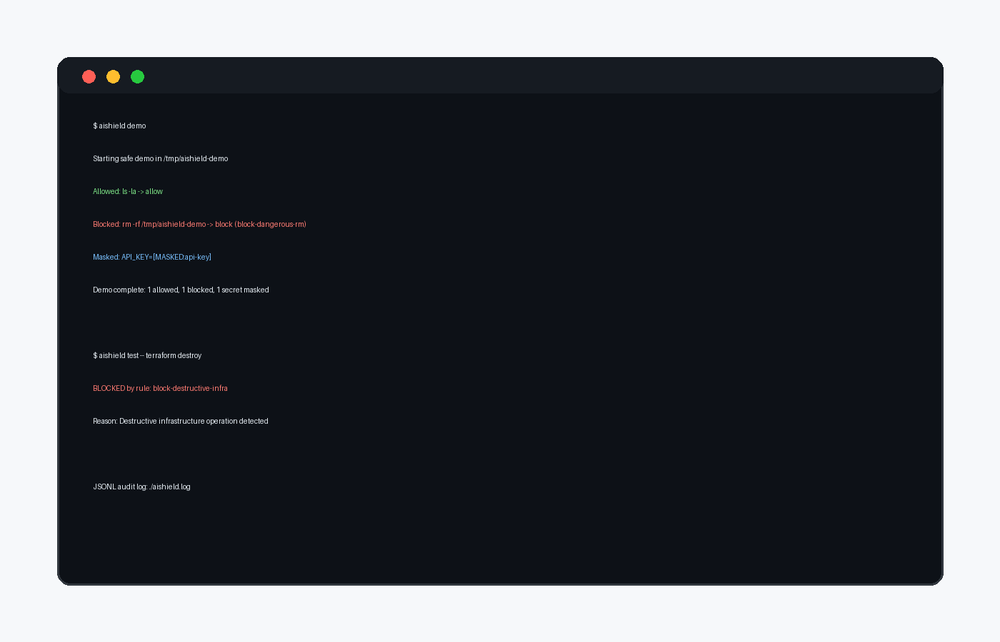
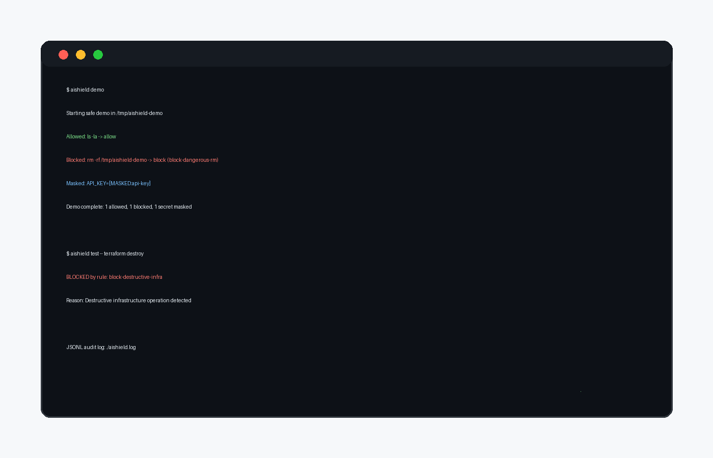

# aishield

**A local safety layer for AI coding agents: block dangerous commands, hide secrets, filter environment variables, and keep an audit trail.**



[](https://github.com/balyakin/aishield/actions/workflows/ci.yaml)
[](https://goreportcard.com/report/github.com/balyakin/aishield)
[](LICENSE)
[](https://github.com/balyakin/aishield)

`aishield` wraps terminal-first AI agents such as Claude Code, Cursor, Codex, Aider, OpenCode, or a plain shell.
It applies deterministic local policies before risky commands run, masks secrets in terminal output and logs, filters
dangerous environment variables, and writes a JSONL audit trail.



## Why aishield?

AI coding agents run with your terminal permissions. They can delete local files, call cloud CLIs, read `.env` files,
or push changes with the same access you have. `aishield` is a practical defense-in-depth layer for accidental
agent mistakes and overly autonomous workflows.

## How It Works

- Blocks destructive commands such as `rm -rf`, `terraform destroy`, `kubectl delete`, and pipe-to-shell patterns.
- Warns before risky operations such as `sudo`, outbound `curl`/`wget`, `git push`, and destructive Docker commands.
- Masks secrets in output and JSONL logs: AWS keys, GitHub tokens, API keys, JWTs, private keys, and connection strings.
- Filters environment variables before the child process starts.
- Uses PTY interception, PATH shims, shell wrapper enforcement, and structured audit logs.
- Includes `aishield test`, `aishield validate`, `aishield demo`, `aishield stats`, `aishield badge`, and local community rules.

## Security Model

`aishield` is defense-in-depth, not a kernel-level sandbox. It reduces risk from accidental AI-agent mistakes through
PTY interception, PATH shims, shell wrapper enforcement, environment filtering, secret masking, and audit logs.
It does not replace containers, VMs, Unix permissions, IAM, secret managers, or native OS sandboxing.

If an AI agent reads a secret file internally and sends it directly to its provider, terminal output masking cannot
guarantee provider-side redaction. Use `aishield` together with least-privilege credentials and proper access controls.

## Compatibility Matrix

| Agent/tool | PTY mode | PATH shim | Env filter | Status |
|---|---:|---:|---:|---|
| Claude Code | yes | yes | yes | needs external smoke test |
| Cursor CLI | yes | yes | yes | needs external smoke test |
| Codex | yes | yes | yes | needs external smoke test |
| Aider | yes | yes | yes | needs external smoke test |
| OpenCode | yes | yes | yes | needs external smoke test |
| Plain bash/zsh | yes | yes | yes | baseline |

## Quick Start

```bash
go install github.com/balyakin/aishield/cmd/aishield@latest

aishield run -- bash
aishield run --preset strict -- codex
aishield init
aishield test -- rm -rf /tmp/test
aishield validate
aishield demo
```

## CLI

```bash
aishield run -- claude-code
aishield test --preset strict -- curl https://example.com
aishield validate --print-effective-config
aishield log --type decision
aishield stats --since 24h
aishield badge
aishield doctor
```

## Presets

| Preset | Default action | Best for |
|---|---|---|
| `strict` | block | production-adjacent work |
| `standard` | allow | daily development |
| `permissive` | allow | trusted local environments |

## Configuration

```bash
aishield init
```

Example rule:

```yaml
rules:
  - name: "block-production-db"
    description: "Block commands that mention production database deletion"
    decision: block
    severity: critical
    match:
      raw_regex:
        - "(?i)prod.*drop"
        - "(?i)prod.*delete"
```

## Log Analysis

`aishield` writes JSONL logs. Every event contains `schema_version`, `session_id`, `event_id`, `backend`, `ts`, and `type`.
Command and decision events include masked command text, decision, matched rule names, severity, and exit code when relevant.

```bash
aishield log
aishield log --type decision
aishield stats
cat aishield.log | jq '.decision'
```

## Community Rules

Community rules live in `community-rules/` and are installed locally through config edits.

```bash
aishield contrib list
aishield contrib search kubectl
aishield contrib info block-k8s-delete
```

## Releases

Releases are built with GoReleaser for Linux and macOS on amd64/arm64 and include SHA256 checksums.
Signed releases and Homebrew tap automation are tracked in [ROADMAP.md](ROADMAP.md).

## Contributing

See [CONTRIBUTING.md](CONTRIBUTING.md).

## License

MIT. Copyright (c) 2026 Evgeny Balyakin.
